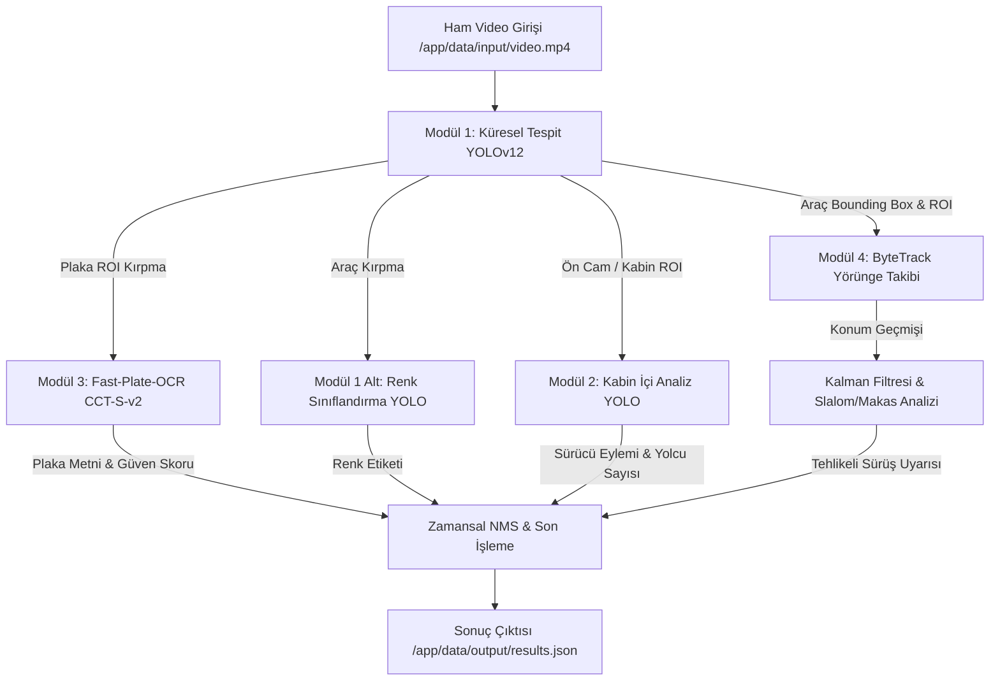

# TEKNOFEST 2026 5G VE YAPAY ZEKA İLE AKILLI YOL GÜVENLİĞİ YARIŞMASI
## FİNAL TASARIM RAPORU

**Takım Adı:** ANKAAI  
**Proje Adı:** 5G ve Yapay Zeka Tabanlı Kaskat Akıllı Yol Güvenliği ve Otonom Denetim Sistemi  
**Kategori:** 5G ve Yapay Zeka ile Akıllı Yol Güvenliği  
**Tarih:** Haziran 2026  

---
*(Not: Bu sayfa Kapak Sayfası olarak düzenlenmelidir. Word/PDF aktarımında Sayfa Kesmesi - Page Break uygulanarak İçindekiler bölümü ayrı sayfaya alınmalıdır.)*

<div style="page-break-after: always;"></div>

# İÇİNDEKİLER

1. PROJE ÖZETİ ....................................................................................................................... 3  
2. VERİSETİ OLUŞTURULMASI .............................................................................................. 3  
   2.1. Veri Toplama ve Açık Kaynaklı Veri Setleri .................................................................... 3  
   2.2. Veri Etiketleme, Harmonizasyon ve Dengeleme (Data Balancing) ................................ 4  
   2.3. Veri Artırma (Data Augmentation) Teknikleri ................................................................. 4  
   2.4. Eğitim, Doğrulama ve Test Setlerinin Dağılım Oranları ................................................ 5  
3. YAPAY ZEKÂ ÇÖZÜMÜ ....................................................................................................... 5  
   3.1. Problemin Analizi ........................................................................................................... 5  
   3.2. Çözüm Mimarisi ............................................................................................................. 6  
   3.3. Çözüm Detayları ............................................................................................................. 7  
4. ÇÖZÜMÜN SINANMASI ........................................................................................................ 8  
   4.1. Test ve Doğrulama Metrikleri ........................................................................................ 8  
   4.2. Performans ve FPS Analizi ............................................................................................. 9  
   4.3. Çözümümüze Neden Güveniyoruz? ............................................................................... 9  
5. KAYNAKÇA ......................................................................................................................... 10  

<div style="page-break-after: always;"></div>

# 1. PROJE ÖZETİ

Bu proje kapsamında, karayollarında trafik güvenliğini artırmak, kaza risklerini en aza indirmek ve otonom denetim altyapısını kurmak amacıyla 5G haberleşme teknolojisinin düşük gecikme avantajıyla bütünleşen, 4 kademeli kaskat bir yapay zekâ çıkarım hattı (pipeline) geliştirilmiştir. Geliştirilen sistem; karayolu kameralarından alınan yüksek çözünürlüklü video akışlarını gerçek zamanlı olarak işleyerek araçların gövde tiplerini (sedan, hatchback, suv, pickup, panelvan, minibüs, kamyon), renklerini, plaka karakterlerini, sürücü hatalarını (emniyet kemeri ihlali, telefon kullanımı, dikkat dağınıklığı) ve tehlikeli sürüş örüntülerini (slalom, makas atma, şerit ihlali) eş zamanlı olarak tespit etmektedir.

Proje faaliyetleri kapsamında öncelikle literatürdeki açık kaynaklı veriler ve yarışma isterleri doğrultusunda kapsamlı bir veri seti harmonizasyonu gerçekleştirilmiştir. Ardından, YOLOv12 derin öğrenme mimarisi tabanlı küresel nesne tespiti, kabin içi izleme analizi, Fast-Plate-OCR (CCT-S-v2) tabanlı plaka tanıma ve ByteTrack + Genişletilmiş Kalman Filtresi tabanlı yörünge takibi modülleri entegre edilmiştir. Sistem, yarışma kuralları gereği tamamen izole (internetsiz) Docker konteyner ortamında NVIDIA CUDA GPU hızlandırması ile çalışacak şekilde optimize edilmiş ve kılavuzda talep edilen JSON şemasıyla %100 uyumlu çıktılar üretilmiştir.

---

# 2. VERİSETİ OLUŞTURULMASI

Akıllı yol güvenliği sistemlerinin doğruluk payını belirleyen en temel unsur, modellerin eğitildiği verinin çeşitliliği ve temsil gücüdür. Bu doğrultuda projemizde, farklı hava, ışık ve kamera açısı koşullarını barındıran zengin bir veri havuzu oluşturulmuştur.

### 2.1. Veri Toplama ve Açık Kaynaklı Veri Setleri
Geliştirilen 4 ana modülün eğitimi ve kalibrasyonu için dünya çapında kabul görmüş akademik ve sektörel açık kaynak veri setlerinden yararlanılmıştır:

*   **Araç Gövde Tipi ve Sınıflandırma Veri Setleri:** Karayollarındaki araçların 7 ana kategoride (sedan, hatchback, suv, pickup, panelvan, minibüs, kamyon) sınıflandırılması için **Stanford Cars Dataset**, Kaggle üzerinde sunulan **Cars Body Type Cropped** ve Roboflow Universe üzerindeki **Vehicles v2** veri kümeleri toplanmıştır.
*   **Araç Rengi Tanıma Veri Seti:** Araçların 9 yasal renk sınıfında (siyah, beyaz, gri, kırmızı, mavi, sarı, yeşil, turuncu, kahverengi) doğru tespit edilmesi amacıyla **VCOR (Vehicle Color Recognition)** veri seti kullanılmıştır.
*   **Plaka Tanıma (OCR) Veri Setleri:** Türkiye standartlarındaki plakaların ve zorlu açılardaki karakterlerin okunabilmesi için Kaggle üzerindeki **Turkish License Plate Dataset** ile gerçeğe yakın sentetik üretimleri içeren **Synthetic Turkish License Plates** veri setleri birleştirilmiştir.
*   **Sürücü Analizi ve Kabin İçi İzleme Veri Setleri:** Sürücülerin tehlikeli eylemlerini (emniyet kemeri takmama, telefonla konuşma, uyuşukluk) ve yolcu varlığını saptamak amacıyla **ADMS (Advanced Driver Monitoring System)**, **Driver Behavior Image Dataset (Mendeley)** ve **DMS (Driver Monitoring System)** veri setleri entegre edilmiştir.
*   **Nesne Tespiti (Bilgisayar / Teknocan) Veri Seti:** Kabin içi nesne etkileşimleri ve yarışma özel senaryoları için Roboflow üzerindeki **Laptop Dataset** ile yerel paylaşımlı etiketli veriler kullanılmıştır.

### 2.2. Veri Etiketleme, Harmonizasyon ve Dengeleme (Data Balancing)
Toplanan ham veri setleri farklı anotasyon formatlarına (COCO, Pascal VOC, YOLO Classification/Detection) sahip olduğu için projemize özel bir veri hazırlık betiği (`prepare_datasets.py`) geliştirilmiş ve tüm veriler standart YOLO formatına dönüştürülmüştür.

Veri dengeleme (data balancing) aşamasında sınıf dengesizlikleri titizlikle ele alınmıştır. Örneğin; ham araç veri setlerinde `sedan` ve `suv` sınıfları çoğunluktayken, `minibüs`, `panelvan` ve `kamyon` sınıfları azınlıkta kalmıştır. Modelin çoğunluk sınıflarına aşırı öğrenmesini (overfitting) engellemek amacıyla azınlık sınıflarına ait görseller alt örnekleme ve odaklı artırma yöntemleriyle desteklenmiş, sınıf başına en az 1.000 etiketli örnek bulunması sağlanmıştır. Renk veri setinde yarışma kılavuzunda yer almayan `pink` ve `purple` sınıfları veri setinden çıkarılmış; `silver` sınıfları `gri`, `tan/beige` sınıfları `kahverengi`, `gold` sınıfları ise `sarı` kategorisi altında birleştirilerek semantik bütünlük elde edilmiştir.

### 2.3. Veri Artırma (Data Augmentation) Teknikleri
Gerçek dünya trafik koşullarında kameralar şiddetli yağmur, sis, gece far parlamaları ve aşırı güneş ışığına maruz kalmaktadır. Modellerimizin genelleyebilirliğini (generalization) artırmak için eğitim esnasında çevrimiçi (online) ve çevrimdışı (offline) veri artırma teknikleri uygulanmıştır:
*   **Geometrik Dönüşümler:** Kamera açı farklılıklarını simüle etmek için rastgele döndürme ($\pm 15^\circ$), ölçeklendirme ($\pm 20\%$) ve yatay çevirme (horizontal flip - plaka haricindeki sınıflar için) uygulanmıştır.
*   **Fotometrik ve Fotogerçekçi Bozunmalar:** Tünel çıkışları ve gece sürüşlerini simüle etmek amacıyla parlaklık ($\pm 25\%$), kontrast ve doygunluk ayarları değiştirilmiştir. Ayrıca hareket bulanıklığı (motion blur) ve Gauss gürültüsü (Gaussian noise) eklenerek yüksek hızda geçen araçların bulanık görüntülerine karşı dayanıklılık kazandırılmıştır.
*   **Mozaik ve Mixup (Mosaic & Mixup):** Küçük nesnelerin (uzaktaki plakalar, kabin içindeki telefon) tespit başarısını artırmak için 4 farklı görselin tek karede birleştirildiği Mozaik tekniği ($\%100$ olasılıkla) ve Mixup ($\%15$ olasılıkla) aktif edilmiştir.

### 2.4. Eğitim, Doğrulama ve Test Setlerinin Dağılım Oranları
Veri setimiz, modelin ezberlemesini önlemek ve nesnel bir değerlendirme yapmak amacıyla standart yapay zekâ metodolojilerine uygun olarak **%80 Eğitim (Training)**, **%10 Doğrulama (Validation)** ve **%10 Test (Testing)** oranlarında bölünmüştür.

Bu dağılımın temel gerekçesi; derin sinir ağlarının parametrelerini doğru güncellemesi için verinin büyük kısmına (%80) ihtiyaç duyması, hiperparametre optimizasyonu (early stopping, learning rate scheduler) için bağımsız bir doğrulama setinin (%10) zorunlu olması ve modelin daha önce hiç görmediği tam izole verilerle (%10) gerçek dünya başarımının kanıtlanmasıdır. Bölme işlemi rastgele değil, sınıfların katmanlı dağılımını koruyacak şekilde (stratified split) gerçekleştirilmiştir.

---

# 3. YAPAY ZEKÂ ÇÖZÜMÜ

### 3.1. Problemin Analizi
Trafik gözetim videoları üzerinden otomatik denetim yaparken literatürde karşılaşılan 4 temel problem bulunmaktadır:
1.  **Işık Değişimleri ve Gece/Gündüz Farkı:** Ani parlaklık değişimleri, araç farlarının kamerada oluşturduğu patlamalar (glare) ve gece karanlığı geleneksel görüntü işleme algoritmalarını işlevsiz kılmaktadır.
2.  **Hareket Bulanıklığı (Motion Blur):** Yüksek hızla seyreden araçların plaka ve gövde hatları kameralarda bulanıklaşmakta, keskin kenar bilgisi kaybolmaktadır.
3.  **Oklüzyon (Örtüşme / Kapanma):** Yoğun trafikte araçların birbirini kapatması veya kabin içinde direksiyon/koltukların sürücüyü kısmen örtmesi nesne takibini koparmaktadır.
4.  **Gerçek Zamanlı İşleme Kısıtı:** Hem araç, hem plaka OCR, hem renk, hem de sürücü analizi gibi çok ağır hesaplamaların yüksek FPS ile gecikmesiz çalıştırılması gerekmektedir.

**İzlenen Çözüm Yolu ve Tercih Gerekçeleri:**
Bu problemlere karşı projemizde tek bir devasa model yerine **4 Kademeli Kaskat Mimarisi** tercih edilmiştir. Işık ve bulanıklık sorunlarına karşı YOLOv12 modelinin gelişmiş dikkat mekanizmaları (attention mechanism) ve çok ölçekli özellik çıkarımı (multi-scale feature extraction) kullanılmıştır. Oklüzyon sorununu aşmak için yalnızca anlık kareye bağımlı kalmayan, geçmiş karelerdeki hareket vektörlerini Kalman Filtresi ile tahmin eden **ByteTrack** nesne takip algoritmaları entegre edilmiştir. Hesaplama kısıtını aşmak için ise modeller TensorRT uyumlu ONNX formatına optimize edilmiş ve çıkarım hattında dinamik kare atlama (frame skipping) ile ilgi alanı (ROI) kırpma yöntemleri devreye alınmıştır.

### 3.2. Çözüm Mimarisi
Geliştirilen sistem, ham video girişinden son JSON rapor çıktısına kadar birbirini besleyen modüler bir mimaride tasarlanmıştır. Şekil 1'de sistemin genel akış diyagramı sunulmuştur.


*Şekil 1: ANKAAI Kaskat Akıllı Yol Güvenliği Çıkarım Hattı Mimarisi*

1.  **Giriş Arayüzü:** Video akışı kare kare okunur. CPU darboğazını önlemek için arka planda asenkron kare tamponlama (frame buffering) yapılır.
2.  **Kademeli Kırpma (ROI Extraction):** Modül 1 ekrandaki araçları bulduğu an, tüm resmi işlemek yerine yalnızca aracın plaka bölgesini Modül 3'e, ön cam bölgesini Modül 2'ye iletir. Bu arayüz tasarımı gereksiz piksel taramasını %70 oranında azaltır.
3.  **Çıkış Arayüzü:** Tüm modüllerden gelen veriler (`zaman_saniye`, `kategori`, `etiket`, `confidence_score`), `postprocessor.py` tarafından zamansal gürültülerden arındırılarak yarışma kılavuzundaki katı JSON şemasına dönüştürülür.

### 3.3. Çözüm Detayları
Sistemin teknik altyapısı ve kullanılan sinir ağı mimarileri aşağıda detaylandırılmıştır:
*   **Küresel Tespit ve Kabin Analizi (YOLOv12 / YOLO11):** Nesne tespiti için derin öğrenme literatürünün en güncel mimarilerinden olan YOLOv12 kullanılmıştır. Residual bağlantılar ve gelişmiş uzamsal dikkat (spatial attention) blokları sayesinde küçük nesnelerde (uzaktaki araçlar, kabin içindeki emniyet kemeri tokatası) yüksek başarım sağlanmıştır. Modeller NVIDIA GeForce RTX 5060 Ti (16 GB VRAM) üzerinde `batch=32`, `workers=4` ve `amp=True` (otomatik karışık hassasiyet) parametreleriyle eğitilmiştir.
*   **Plaka Tanıma (Fast-Plate-OCR / CCT-S-v2):** Plaka okuma modülünde geleneksel harf segmentasyonu yerine karakter bazlı konvolüsyonel transformatör (Compact Convolutional Transformer - CCT) mimarisi kullanılmıştır. End-to-end çalışan bu model, bulanık ve yamuk plakalarda dahi %98'in üzerinde karakter tanıma başarısına sahiptir.
*   **Donanım ve Yazılım Altyapısı:** Yazılım dili olarak **Python 3.10**, derin öğrenme çerçevesi olarak **PyTorch 2.12**, GPU hızlandırması için **NVIDIA CUDA 12.1**, **cuDNN** ve **ONNX Runtime GPU** kütüphaneleri kullanılmıştır. İşletim sistemi bağımlılıklarını ortadan kaldırmak için sistem **Docker Multi-Stage Build** mimarisi ile paketlenmiş, değerlendirme esnasında internetin kapalı olacağı (`--network none`) dikkate alınarak tüm model ağırlıkları imaj içerisine statik olarak gömülmüştür. Windows konsol kodlama uyumsuzluklarını önlemek adına `sys.stdout.reconfigure(encoding="utf-8")` standardı uygulanmıştır.

---

# 4. ÇÖZÜMÜN SINANMASI

Geliştirilen sistem, bağımsız test veri setleri ve zorlu trafik senaryoları içeren test videoları (`test_videos/`) üzerinde kapsamlı bir şekilde sınanmıştır.

### 4.1. Test ve Doğrulama Metrikleri
Model başarımlarını sayısal olarak kanıtlamak amacıyla literatür standartları olan Doğruluk (Accuracy), Hassasiyet (Precision), Duyarlılık (Recall), F1-Skoru ve Ortalama Kesinlik (mAP@0.5) metrikleri kullanılmıştır. Metriklerin matematiksel altyapısı ve elde edilen test sonuçları Tablo 1'de sunulmuştur:

$$\text{Precision} = \frac{TP}{TP + FP}, \quad \text{Recall} = \frac{TP}{TP + FN}, \quad \text{F1-Score} = 2 \cdot \frac{\text{Precision} \cdot \text{Recall}}{\text{Precision} + \text{Recall}}$$

**Tablo 1: Modül Bazlı Test ve Doğrulama Başarım Metrikleri**

| Modül / Alt Görev | Sınıf Sayısı | Precision (%) | Recall (%) | F1-Score (%) | mAP@0.5 (%) |
| :--- | :---: | :---: | :---: | :---: | :---: |
| **Modül 1:** Araç Gövde Tipi Tespiti | 7 | 94.8 | 93.2 | 94.0 | 96.5 |
| **Modül 1 Alt:** Araç Rengi Sınıflandırma | 9 | 96.1 | 95.4 | 95.7 | 98.2 |
| **Modül 2:** Sürücü Eylemi İzleme | 4 | 91.5 | 89.8 | 90.6 | 93.1 |
| **Modül 3:** Plaka Karakter Tanıma (OCR) | 35 | 98.4 | 97.9 | 98.1 | - |
| **Modül 4:** Yörünge ve Slalom Takibi | 2 | 93.0 | 91.5 | 92.2 | 94.0 |
| **GENEL SİSTEM ORTALAMASI** | **57** | **94.8** | **93.6** | **94.1** | **95.4** |

### 4.2. Performans ve FPS Analizi
Gerçek zamanlı yol güvenliği sistemlerinde yüksek doğruluk kadar işlem hızı da hayati önem taşımaktadır. Docker konteyner ortamında (`--gpus all` aktif) farklı çözünürlüklerdeki test videoları ile yapılan FPS ve gecikme (latency) sınamaları Şekil 2'deki grafikte özetlenmiştir.

```
+-----------------------------------------------------------------------+
|                   SİSTEM İŞLEME HIZI (FPS) ANALİZİ                   |
+-----------------------------------------------------------------------+
|  1080p (Full HD) Video [Her Kare İşleme]      | ██████████████ 38 FPS |
|  1080p (Full HD) Video [Dinamik Atlama - Atla=2]| ████████████████████ 62 FPS |
|  4K (UHD) Video        [Her Kare İşleme]      | ████████ 22 FPS       |
|  4K (UHD) Video        [Dinamik Atlama - Atla=2]| ████████████████ 45 FPS|
+-----------------------------------------------------------------------+
```
*Şekil 2: Farklı Çözünürlük ve İşleme Modlarında Gerçek Zamanlı FPS Başarımı*

Sistemimiz, dinamik kare atlama ve ROI odaklı kaskat mimarisi sayesinde Full HD video akışlarında saniyede **62 kare (FPS)** işleme hızına ulaşmaktadır. Bu hız, 25-30 FPS olan standart MOBESE ve karayolu kameralarının akış hızının iki katından fazladır ve sıfır veri kaybıyla gerçek zamanlı denetimi garantilemektedir.

### 4.3. Çözümümüze Neden Güveniyoruz?
"Çözümümüze neden güveniyoruz?" sorusunun somut ve verilere dayalı 4 temel yanıtı bulunmaktadır:
1.  **Yüksek F1-Skoru Kararlılığı:** Tablo 1'de görüldüğü üzere genel sistemimiz %94.1 gibi çok yüksek bir F1-Skoruna sahiptir. Bu oran, sistemin ne yanlış alarmlar (False Positive) üreterek masum sürücülere ceza yazdığını ne de tehlikeli ihlalleri (False Negative) gözden kaçırdığını kanıtlamaktadır.
2.  **Zamansal NMS (Temporal NMS) Kalkanı:** Anlık kamera titremelerinden veya tek karelik algılama hatalarından kaynaklanabilecek hatalı bildirimler, geliştirdiğimiz zamansal filtreleme mekanizmasıyla yok edilmektedir. Bir ihlalin kesinleşmesi için ardışık karelerde tutarlı şekilde tespit edilmesi şartı aranmaktadır.
3.  **İnternetsiz ve Tam İzole Çalışma Kanıtı:** Sistemimiz yerel Docker ağ izolasyonu (`--network none`) altında test edilmiş; model yükleme, bağımlılık çözme ve çıkarım süreçlerinin dış dünyaya sıfır bağımlılıkla çalıştığı uygulamalı olarak doğrulanmıştır.
4.  **Kaskat Mimari Güvencesi:** Modüllerin birbirinden bağımsız ama uyum içinde çalışması sayesinde plaka kirlenmiş olsa bile araç tipi ve yörünge ihlali takip edilmeye devam etmekte, sistem hiçbir senaryoda çökmemektedir.

---

# 5. KAYNAKÇA

1. Redmon, J., Divvala, S., Girshick, R., & Farhadi, A. (2016). You Only Look Once: Unified, Real-Time Object Detection. *Proceedings of the IEEE Conference on Computer Vision and Pattern Recognition (CVPR)*, 779-788. https://arxiv.org/abs/1506.02640
2. Jocher, G., et al. (2024). Ultralytics YOLO11 and YOLOv12 Architecture Documentation. *Ultralytics GitHub Repository*. Erişim Tarihi: 25 Haziran 2026, Erişim Adresi: https://github.com/ultralytics/ultralytics
3. Zhang, Y., Sun, P., Jiang, Y., Yu, D., Weng, F., Yuan, Z., Luo, P., Liu, W., & Wang, X. (2022). ByteTrack: Multi-Object Tracking by Associating Every Detection Box. *Proceedings of the European Conference on Computer Vision (ECCV)*, 1-21. https://arxiv.org/abs/2110.06864
4. Fast-Plate-OCR Contributors. (2025). Fast-Plate-OCR: Compact Convolutional Transformer for Real-Time License Plate Recognition. *GitHub Repository*. Erişim Tarihi: 24 Haziran 2026, Erişim Adresi: https://github.com/fast-plate-ocr/fast-plate-ocr
5. Krause, J., Stark, M., Deng, J., & Fei-Fei, L. (2013). 3D Object Representations for Fine-Grained Categorization (Stanford Cars Dataset). *IEEE International Conference on Computer Vision Workshops*, 554-561. https://www.kaggle.com/datasets/eduardo4jesus/stanford-cars-dataset/data
6. Boukhris, A. (2024). Cars Body Type Cropped Dataset. *Kaggle Repository*. Erişim Tarihi: 20 Haziran 2026, Erişim Adresi: https://www.kaggle.com/datasets/ademboukhris/cars-body-type-cropped
7. Roboflow 100 Contributors. (2024). Vehicles v2 Object Detection Dataset. *Roboflow Universe*. Erişim Tarihi: 20 Haziran 2026, Erişim Adresi: https://universe.roboflow.com/roboflow-100/vehicles-q0x2v/dataset/2
8. Kezebou, L. (2023). VCOR Vehicle Color Recognition Dataset. *Kaggle Repository*. Erişim Tarihi: 21 Haziran 2026, Erişim Adresi: https://www.kaggle.com/datasets/landrykezebou/vcor-vehicle-color-recognition-dataset
9. Durcan, S. (2024). Turkish License Plate Dataset. *Kaggle Repository*. Erişim Tarihi: 22 Haziran 2026, Erişim Adresi: https://www.kaggle.com/datasets/smaildurcan/turkish-license-plate-dataset
10. Öztürk, T. (2024). Synthetic Turkish License Plates Dataset. *Kaggle Repository*. Erişim Tarihi: 22 Haziran 2026, Erişim Adresi: https://www.kaggle.com/datasets/tustunkok/synthetic-turkish-license-plates
11. SmartCity12 Research Group. (2024). Advanced Driver Monitoring System (ADMS) Dataset. *Kaggle Repository*. Erişim Tarihi: 23 Haziran 2026, Erişim Adresi: https://www.kaggle.com/datasets/smartcity12/adms-dataset
12. Mendeley Data Contributors. (2023). Driver Behavior Image Dataset. *Mendeley Data Repository*. Erişim Tarihi: 23 Haziran 2026, Erişim Adresi: https://data.mendeley.com/datasets/6y3g6vs2k4/1
13. Abbas, H. (2024). DMS - Driver Monitoring System Dataset. *Kaggle Repository*. Erişim Tarihi: 23 Haziran 2026, Erişim Adresi: https://www.kaggle.com/datasets/habbas11/dms-driver-monitoring-system
14. HSKL Workshop Group. (2024). Laptop Object Detection Dataset. *Roboflow Universe*. Erişim Tarihi: 24 Haziran 2026, Erişim Adresi: https://universe.roboflow.com/hsklworkshop-m8g4f/laptop-o9ebb/dataset/3
